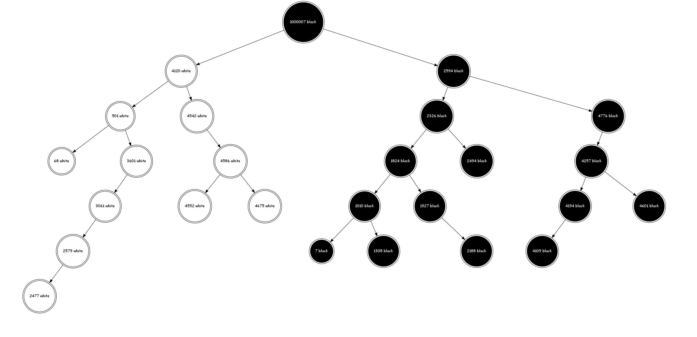
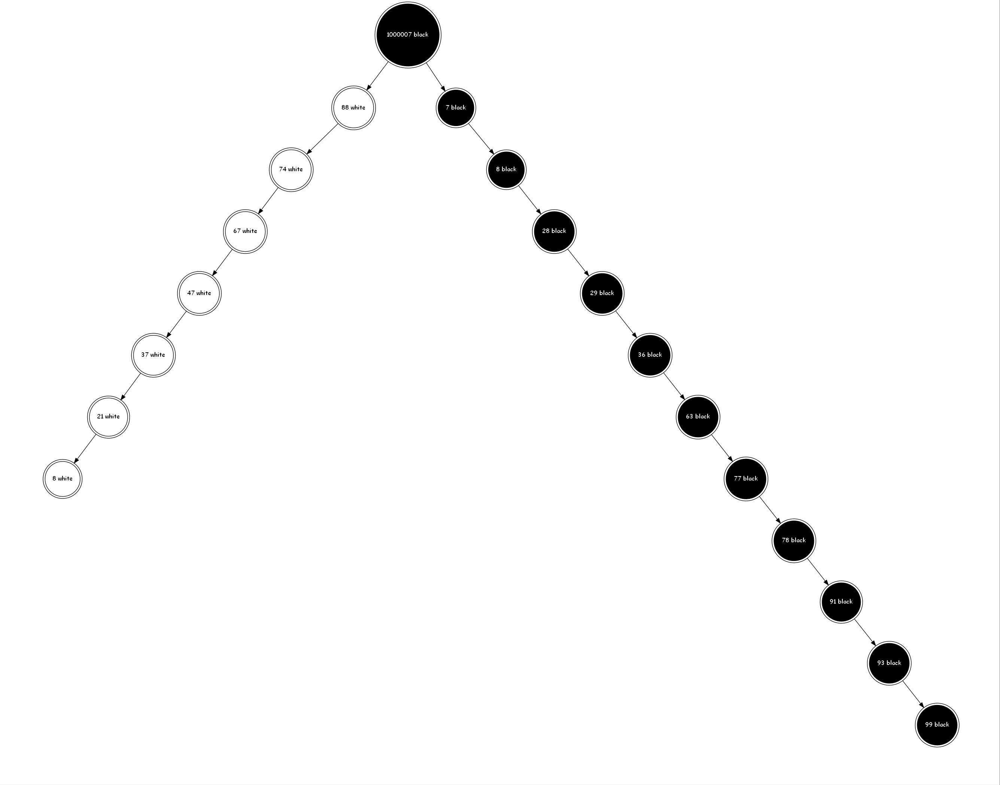

# Binary_Trees_Special_Transformations

* In This Repository, We Implement The Binary Tree Data Structure.
* After That We Perform Some Very Special Transformations On The Tree Using Some Nice Algorithms

## Binary Tree Structure

* the structure of our tree is special
* because every node contains two values:
    1- the data value
    2- the color value (white or black)

* there is only two colors so the color value is a boolean
    1- true if the color is black
    2- false if it is white

* the root is a special node, because it have a value that is greater than all values in the tree and its color is black

## After the construction, The tree should look like this:

# Now coming to the transformations

* the first transformation is an easy one
* it makes the right subtree an increasing list of nodes having only exactly one right child
* and it makes the left subtree a decreasing list of nodes having only exactly one left child
* this transoformation is obtained by:
    >1- for the right subtree:
        >>* starting from the right child of the root
        >>* perform right rotations for each node until no left child remains
        >>* after that go right and repeat the second step
    
    >2- for the left subtree:
        >>* starting from the left child of the root
        >>* perform left rotations for each node until no right child remains
        >* after that go left and repeat the second step

    
* after performing this simple algorithm we should obtain the following result:
